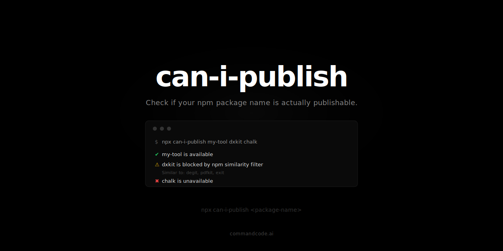

<p align="center">
  
</p>

<p align="center">
  Check if your npm package name is actually publishable.<br/>
  Tests against npm's undocumented similarity filter, not just the registry.
</p>

<p align="center">
  <a href="https://www.npmjs.com/package/can-i-publish"></a>
  <a href="https://github.com/saqibameen/can-i-publish/blob/main/LICENSE"></a>
</p>

## The Problem

You check if a package name is available on npm. It says yes. You build the whole thing. You run `npm publish`. Boom:

```
403 Package name too similar to existing packages degit,pdfkit,exit
```

npm has an **undocumented similarity filter** that blocks names even if they don't exist on the registry. `npm publish --dry-run` [doesn't catch it either](https://github.com/npm/rfcs/discussions/501). Neither does [`npm-name-cli`](https://github.com/sindresorhus/npm-name-cli).

`can-i-publish` actually tests publishability by checking both the registry AND the similarity filter.

> [!NOTE]
> Similarity filter testing requires `npm login`. Without it, registry and squatter checks still work.

### `npm-name-cli` vs `can-i-publish`

Try it yourself — check `dxkit`, a name that looks available but is actually blocked:

```bash
# npm-name-cli says it's available (wrong — will fail on npm publish)
$ npx npm-name-cli dxkit
✔ dxkit is available

# can-i-publish catches the similarity block
$ npx can-i-publish dxkit
⚠ dxkit is blocked by npm similarity filter
  Similar to: degit, pdfkit, exit
```

Other names you can verify: `reacto`, `expresss`, `loadash`, `chulk`.

| | `npm-name-cli` | `can-i-publish` |
|---|---|---|
| Registry check | Yes | Yes |
| Organization check (`@org`) | Yes | Yes |
| Squatter detection | Yes | Yes |
| Similarity filter | No | Yes |
| Catches `dxkit` as blocked | No | Yes |
| Shows similar packages | No | Yes |
| Suggests alternatives | No | Yes (`--suggest`) |

## Install

```bash
npx can-i-publish my-package
```

Or install globally:

```bash
npm install -g can-i-publish
```

## Usage

```bash
# Check a single name
can-i-publish my-package

# Check multiple names at once
can-i-publish my-tool my-lib my-app

# Check an organization name
can-i-publish @my-org

# Get suggestions if blocked
can-i-publish dxkit --suggest

# JSON output (for scripting)
can-i-publish my-package --json
```

## Output

```bash
$ can-i-publish abc123 chalk dxkit my-cool-tool @ava

⚠ abc123 is squatted (https://www.npmjs.com/package/abc123)
✖ chalk is unavailable (https://www.npmjs.com/package/chalk)
⚠ dxkit is blocked by npm similarity filter
  Similar to: degit, pdfkit, exit
✔ my-cool-tool is available
✖ @ava is unavailable (https://www.npmjs.com/org/ava)
```

## How It Works

1. **Validates** the name against npm naming rules (lowercase, no spaces, under 214 chars)
2. **Checks the registry** to see if the package already exists
3. **Detects squatters** — flags packages that exist but appear abandoned (low downloads, no readme, no prod version)
4. **Tests the similarity filter** by attempting a publish probe against the npm registry using your npm credentials

## Options

| Flag | Description |
|------|-------------|
| `-s, --suggest` | Suggest alternative names if unavailable |
| `-j, --json` | Output results as JSON |
| `-V, --version` | Show version |
| `-h, --help` | Show help |

## Exit Codes

- `0` — all names are available or squatted
- `1` — one or more names are unavailable, blocked, or invalid

Useful for CI/scripting:

```bash
can-i-publish my-package && npm publish
```

## Programmatic API

```typescript
import { checkName, suggestNames } from 'can-i-publish';

const result = await checkName({ name: 'my-package' });
// { name, status: 'available' | 'taken' | 'squatted' | 'blocked' | 'invalid', reason?, similarTo? }

const suggestions = await suggestNames({ name: 'dxkit', limit: 5 });
// [{ name: 'dxkit-cli', status: 'available' }, ...]
```

## Credits

Inspired by [`npm-name-cli`](https://github.com/sindresorhus/npm-name-cli) by [Sindre Sorhus](https://github.com/sindresorhus).

## License

MIT

---

Built with [commandcode](https://commandcode.ai) by [@saqibameen](https://x.com/saqibameen)
